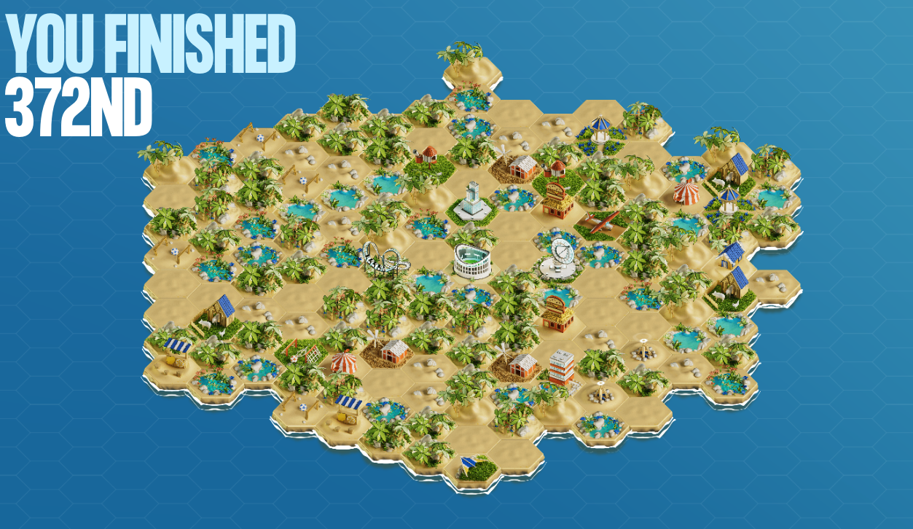

# 2025 IMC Prosperity Challenge

I've always had interest in financial markets, but this was my first time learning to algo trade.

Giving credit where credit is due. I heavily relied on these resources for testing:
- https://github.com/jmerle/imc-prosperity-3-submitter
- https://github.com/jmerle/imc-prosperity-3-visualizer
- https://github.com/jmerle/imc-prosperity-3-backtester

Another resource I used was this:
- https://github.com/pe049395/IMC-Prosperity-2024

Because I am a completely new to algo trading, I decided to reverse engineer what successful algo traders have done in the past. My code is an extension/modification of the code shared above.

## Round results



<table>
    <thead>
        <tr>
            <th></th>
            <th colspan="4" style="text-align: center">Profit / loss</th>
            <th colspan="4" style="text-align: center">Leaderboard position</th>
        </tr>
        <tr>
            <th></th>
            <th>Overall</th>
            <th>Manual</th>
            <th>Algo</th>
            <th>Round</th>
            <th>Overall</th>
            <th>Manual</th>
            <th>Algo</th>
            <th>Country</th>
        </tr>
    </thead>
    <tbody>
        <tr>
            <td>1</td>
            <td>90,596</td>
            <td>44,340</td>
            <td>46,256</td>
            <td>90,596</td>
            <td>197</td>
            <td>1409</td>
            <td>210</td>
            <td>59</td>
        </tr>
        <tr>
            <td>2</td>
            <td>180,893</td>
            <td>26,015</td>
            <td>64,282</td>
            <td>90,297</td>
            <td>352</td>
            <td>1160</td>
            <td>308</td>
            <td>117</td>
        </tr>
        <tr>
            <td>3</td>
            <td>275,608</td>
            <td>42,390</td>
            <td>52,324</td>
            <td>94,715</td>
            <td>551</td>
            <td>1097</td>
            <td>517</td>
            <td>151</td>
        </tr>
        <tr>
            <td>4</td>
            <td>381,444</td>
            <td>43,204</td>
            <td>62,632</td>
            <td>105,836</td>
            <td>369</td>
            <td>924</td>
            <td>318</td>
            <td>109</td>
        </tr>
        <tr>
            <td>5</td>
            <td>460,248</td>
            <td>81,607</td>
            <td>-2,803</td>
            <td>78,803</td>
            <td>372</td>
            <td>515</td>
            <td>390</td>
            <td>103</td>
        </tr>
    </tbody>
</table>

There were 12,620 competing in the tournament, so I finished in the top 3%.

# Phases

## Tutorial
<details>
  <summary>
    <span style="font-size:15px">Click here for round details</span>
    <hr/>
  </summary>
  
    In the tutorial round there are two tradable goods: `Rainforest Resin` and `Kelp`. While the value of the `Rainforest Resin` has been stable throughout the history of the archipelago, the value of `Kelp` has been going up and down over time. 

    Position limits for the newly introduced products:

    - `RAINFOREST_RESIN`: 50
    - `KELP`: 50

    ⚠️ All algorithms uploaded in the tutorial round will be processed and generate results instantly, so you can experiment with different programs and strategies.
</details>

I didn't really test much during this phase. Most of my time was spent reading the Notion wiki. I submitted a file or two to get used to the file upload feature and was researching general market making strategies.

## Round 1
<details>
  <summary>
    <span style="font-size:15px">Click here for round details</span>
    <hr/>
  </summary>

    ## Algorithm challenge

    The first three tradable products are introduced: : `Rainforest Resin` , `Kelp`, and `Squid Ink`. The value of the `Rainforest Resin` has been stable throughout the history of the archipelago, the value of `Kelp` has been going up and down over time, and the value of `Squid Ink` can also swing a bit, but some say there is a pattern to be discovered in its prize progression. All algorithms uploaded in the tutorial round will be processed and generate results instantly, so you can experiment with different programs and strategies.

    Position limits for the newly introduced products:

    - `RAINFOREST_RESIN`: 50
    - `KELP`: 50
    - `SQUID_INK`: 50

    ### Hint

    Squid Ink can be a very volatile product with price having large swings. Making a two-sided market or carrying position can be risky for such an instrument. However, with large swings comes large reversion. Squid Ink prices show more tendency to revert short term swings in price.

    A metric to keep track of the size of deviation/swing from recent average could help in trading profitable positions.

    ## Manual challenge

    You get the chance to do a series of trades in some foreign island currencies. The first trade is a conversion of your SeaShells into a foreign currency, the last trade is a conversion from a foreign currency into SeaShells. Everything in between is up to you. Give some thought to what series of trades you would like to do, as there might be an opportunity to walk away with more shells than you arrived with.
</details>


I only had a few hours to submit my code for this one because of a busy schedule with school and work. I didn't discover the submitter, visualizer, or backtester resources mentioned above, so I just had to manually run and check on IMC's website which was really tedious. The manual challenge was straightforward and fun. I modeled the the forex table as a graph traversal problem where each node is a currency and each directed edge represents a trade with a multiplicative weight (conversion rate). I then ran DFS with a limit of 5 because we were looking for a cycle with 5 edges and found the optimal solution. Code shown below.

```
def dfs(graph, current, depth, product, path, max_result):
    if depth == 5:
        if current == "shell":
            if product > max_result["max"]:
                max_result["max"] = product
                max_result["path"] = path[:]
        return

    for neighbor, rate in graph[current].items():
        path.append(neighbor)
        dfs(graph, neighbor, depth + 1, product * rate, path, max_result)
        path.pop()


graph = {
    "snow":    {"snow": 1,    "pizza": 1.45, "nugget": 0.52, "shell": 0.72},
    "pizza":   {"snow": 0.7,  "pizza": 1,    "nugget": 0.31, "shell": 0.48},
    "nugget":  {"snow": 1.95, "pizza": 3.1,  "nugget": 1,    "shell": 1.49},
    "shell":   {"snow": 1.34, "pizza": 1.98, "nugget": 0.64, "shell": 1},
}

max_result = {"max": 0, "path": []}
dfs(graph, "shell", 0, 1.0, ["shell"], max_result)

print("Best product:", max_result["max"])
print("Best path:", " -> ".join(max_result["path"]))
```

My final answer was SeaShells --> Snowballs --> Silicon Nuggets --> Pizza --> Snowballs --> SeaShells

## Round 2

<details>
  <summary>
    <span style="font-size:15px">Click here for round details</span>
    <hr/>
  </summary>

    ## Algorithm challenge

    In this second round, you’ll find that everybody on the archipelago loves to picnic. Therefore, in addition to the products from round one, two Picnic Baskets are now available as a tradable good. 

    `PICNIC_BASKET1` contains three products: 

    1. Six (6) `CROISSANTS`
    2. Three (3) `JAMS`
    3. One (1) `DJEMBE`

    `PICNIC_BASKET2` contains just two products: 

    1. Four (4) `CROISSANTS`
    2. Two (2) `JAMS`

    Aside from the Picnic Baskets, you can now also trade the three products individually on the island exchange. 

    Position limits for the newly introduced products:

    - `CROISSANTS`: 250
    - `JAM`: 350
    - `DJEMBE`: 60
    - `PICNIC_BASKET1`: 60
    - `PICNIC_BASKET2`: 100

    ## Manual challenge

    Some shipping containers with valuables inside washed ashore. You get to choose a maximum of two containers to open and receive the valuable contents from. The first container you open is free of charge, but for the second one you will have to pay some SeaShells. Keep in mind that you are not the only one choosing containers and making a claim on its contents. You will have to split the spoils with all others that choose the same container. So, choose carefully. 

    Here's a breakdown of how your profit from a container will be computed:
    Every container has its **treasure multiplier** (up to 90) and number of **inhabitants** (up to 10) that will be choosing that particular container. The container’s total treasure is the product of the **base treasure** (10 000, same for all containers) and the container’s specific treasure multiplier. However, the resulting amount is then divided by the sum of the inhabitants that choose the same container and the percentage of opening this specific container of the total number of times a container has been opened (by all players). 

    For example, if **5 inhabitants** choose a container, and **this container was chosen** **10% of the total number of times a container has been opened** (by all players), the prize you get from that container will be divided by 15. After the division, **costs for opening a container** apply (if there are any), and profit is what remains.

</details>

I finally discovered the visualizer and backtester tools. I opened up the visualizer and was trying to analyze each timestamp but it was a bit unclear to me what was going on. The anonymized market trades and own_trades fields seemed inconsistent with the profit/loss and positions fields but maybe I'm missing something. Either way, the tool was useful to quickly test if any new logic would improve long term profits or not. The manual trading for this phase was interesting. I tried to model the situation with the following Python code:

```
choices_1 = [(10, 1), (80, 6), (37, 3), (90, 10), (31, 2), (17, 1), (20, 2), (73, 4), (50, 4), (89, 8)]
choices_2 = [(10, 1), (80, 6), (37, 3), (90, 10), (31, 2), (17, 1), (20, 2), (73, 4), (50, 4), (89, 8)]

output = {}

# Fixed percentage of total openings (10%)
fixed_percentage = 10

# If going for 2 choices
for choice_1 in choices_1:
    for choice_2 in choices_2:
        # Ensure we're not picking the same container twice
        if choice_1 != choice_2:
            # Calculate treasure from choice 1 with fixed percentage
            treasure_1 = (10000 * choice_1[0]) / (choice_1[1] + fixed_percentage)
            # Calculate treasure from choice 2 with fixed percentage
            treasure_2 = (10000 * choice_2[0]) / (choice_2[1] + fixed_percentage)
            # Total treasure after subtracting the 50,000 cost for second container
            y = treasure_1 + treasure_2 - 50000
            output[y] = f"{choice_1[0]}x {choice_1[1]} inhab and {choice_2[0]}x {choice_2[1]} inhab"


# If going for 1 choice
for choice_1 in choices_1:
    # Calculate treasure from choice 1 with fixed percentage
    treasure_1 = (10000 * choice_1[0]) / (choice_1[1] + fixed_percentage)
    output[treasure_1] = f"{choice_1[0]}x {choice_1[1]} inhab"

for key in sorted(output.keys(), reverse=True):
    print(f"Key: {key}, Value: {output[key]}")
```

My final answer was one choice: 73x multiplier with 4 inhabitants

## Round 3
<details>
  <summary>
    <span style="font-size:15px">Click here for round details</span>
    <hr/>
  </summary>
  
    ## Algorithm challenge

    Our inhabitants really like volcanic rock. So much even, that they invented a new tradable good, `VOLCANIC ROCK VOUCHERS`. The vouchers will give you the right but not obligation to buy `VOLCANIC ROCK` at a certain price (strike price) at voucher expiry timestamp. These vouchers can be traded as a separate item on the island’s exchange. Of course you will have to pay a premium for these vouchers, but if your strategy is solid as a rock, SeaShells spoils will be waiting for you on the horizon. 

    There are five Volcanic Rock Vouchers, each with their own **strike price** and **premium.** 

    **At beginning of Round 1, all the Vouchers have 7 trading days to expire. By end of Round 5, vouchers will have 2 trading days left to expire.**

    Position limits for the newly introduced products:

    - `VOLCANIC_ROCK`: 400

    `VOLCANIC_ROCK_VOUCHER_9500` :

    - Position Limit: 200
    - Strike Price: 9,500 SeaShells
    - Expiration deadline: 7 days (1 round = 1 day) starting from round 1

    `VOLCANIC_ROCK_VOUCHER_9750` :

    - Position Limit: 200
    - Strike Price: 9,750 SeaShells
    - Expiration deadline: 7 days (1 round = 1 day) starting from round 1

    `VOLCANIC_ROCK_VOUCHER_10000` :

    - Position Limit: 200
    - Strike Price: 10,000 SeaShells
    - Expiration deadline: 7 days (1 round = 1 day) starting from round 1

    `VOLCANIC_ROCK_VOUCHER_10250` :

    - Position Limit: 200
    - Strike Price: 10,250 SeaShells
    - Expiration deadline: 7 days (1 round = 1 day) starting from round 1

    `VOLCANIC_ROCK_VOUCHER_10500` :

    - Position Limit: 200
    - Strike Price: 10,500 SeaShells
    - Expiration deadline: 7 days (1 round = 1 day) starting from round 1

    ### Hint for Algorithmic Challenge

    Hello everyone, hope you're enjoying the VOLCANIC_ROCK vouchers and a variety of trading strategies these new products introduce. While digging for the rock, Archipelago residents found some ancient mathematics sharing insights into VOLCANIC_ROCK voucher trading. Here's what the message with obscure and advanced mathematics read,

    Message begins,

    I have discovered a strategy which will make ArchiCapital the biggest trading company ever. Here's how my thesis goes,

    t: Timestamp
    St: Voucher Underlying Price at t
    K: Strike
    TTE: Remaining Time till expiry at t
    Vt: Voucher price of strike K at t

    Compute,

    m_t = log(K/St)/ sqrt(TTE)
    v_t = BlackScholes ImpliedVol(St, Vt, K, TTE)

    for each t, plot v_t vs m_t and fit a parabolic curve to filter random noise.

    This fitted v_t(m_t) allows me to evaluate opportunities between different strikes. I also call fitted v_t(m_t=0) the base IV and I have identified interesting patterns in timeseries of base IV.

    Message ends.

    ## Manual challenge

    A big group of Sea Turtles is visiting our shores, bringing with them an opportunity to acquire some top grade `FLIPPERS`. You only have two chances to offer a good price. Each one of the Sea Turtles will accept the lowest bid that is over their reserve price. 

    The distribution of reserve prices is uniform between 160–200 and 250–320, but none of the Sea Turtles will trade between 200 and 250 due to some ancient superstition.

    For your second bid, they also take into account the average of the second bids by other traders in the archipelago. They’ll trade with you when your offer is above the average of all second bids. But if you end up under the average, the probability of a deal decreases rapidly. 

    To simulate this probability, the PNL obtained from trading with a fish for which your second bid is under the average of all second bids will be scaled by a factor *p*:

    $$
    p = (\frac{320 – \text{average bid}}{320 – \text{your bid}})^3
    $$

    You know there’s a constant desire for Flippers on the archipelago. So, at the end of the round, you’ll be able to sell them for 320 SeaShells ****a piece.

    Think hard about how you want to set your two bids, place your feet firmly in the sand and brace yourself, because this could get messy.
</details>

I did not have much time this round. I only traded `VOLCANIC_ROCK_VOUCHER_9500` since it was most in-the-money and my volatatility arb strategy was profitable and my manual challenge entries were just guesses.

## Round 4
<details>
  <summary>
    <span style="font-size:15px">Click here for round details</span>
    <hr/>
  </summary>
  
    ## Algorithm challenge

    In this fourth round of Prosperity a new luxury product is introduced: `MAGNIFICENT MACARONS`. `MAGNIFICENT MACARONS` are a delicacy and their value is dependent on all sorts of observable factors like hours of sun light, sugar prices, shipping costs, in- & export tariffs and suitable storage space. Can you find the right connections to optimize your program? 

    Position limits for the newly introduced products:

    - `MAGNIFICENT_MACARONS`: 75
    - Conversion Limit for `MAGNIFICENT_MACARONS` = 10

    ## Hint - Algo

    It was well understood lore in Archipelago that low sunlight index can impact sugar and MACARON production negatively causing prices to rise due to panic among residents. However, ArchiResearchers have identified existence of a CriticalSunlightIndex (CSI).

    If sunlightIndex goes below this CSI with an anticipation to remain under this critical level for a long period of time, sugar and MACARON prices can increase by substantial amount with a strong correlation.

    When sunlightIndex is above this CSI, Sugar and MACARON prices tend to trade around their respective fair values and demonstrates market supply-demand dynamics.

    Can you find this CSI and use it to trade better than ever and make your island prosper? All the best!

    ## Manual challenge

    You’re participating in a brand new game show and have the opportunity to open up a maximum of three suitcases with great prizes in them. The whole archipelago is participating, so you’ll have to share the spoils with everyone choosing the same suitcase. Opening one suitcase is free, but for the second and third one you’ll need to pay to get inside. 

    Here's a breakdown of how your profit from a suitcase will be computed:
    Every suitcase has its **prize multiplier** (up to 100) and number of **inhabitants** (up to 15) that will be choosing that particular suitcase. The suitcase’s total treasure is the product of the **base treasure** (10 000, same for all suitcases) and the suitcase’s specific treasure multiplier. However, the resulting amount is then divided by the sum of the inhabitants that choose the same suitcase and the percentage of opening this specific suitcase of the total number of times a suitcase has been opened (by all players). 

    For example, if **5 inhabitants** choose a suitcase, and **this suitcase was chosen** **10% of the total number of times a suitcase has been opened** (by all players), the prize you get from that suitcase will be divided by 15. After the division, **costs for opening a suitcase** apply (if there are any), and profit is what remains.

    To help you with your decision making, here's the distribution of player's choices from **Round 2** Manual: 

    

    ## Additional trading microstructure information:

    1. ConversionObservation (detailed in “[Writing an Algorithm in Python](https://www.notion.so/Writing-an-Algorithm-in-Python-17be8453a09381988c6ed45b1b597049?pvs=21)” under E-learning center) shows quotes of `MAGNIFICENT_MACARONS` offered by the chefs from Pristine Cuisine
    2. To purchase 1 unit of `MAGNIFICENT_MACARONS` from Pristine Cuisine, you will purchase at askPrice, pay `TRANSPORT_FEES` and `IMPORT_TARIFF`
    3. To sell 1 unit of `MAGNIFICENT_MACARONS` to Pristine Cuisine, you will sell at bidPrice, pay `TRANSPORT_FEES` and `EXPORT_TARIFF`
    4. You can ONLY trade with Pristine Cuisine via the conversion request with applicable conditions as mentioned in the wiki
    5. For every 1 unit of `MAGNIFICENT_MACARONS` net long position, storage cost of 0.1 Seashells per timestamp will be applied for the duration that position is held. No storage cost applicable to net short position
</details>

I did not have much time this round. I did not trade any of the newly introdued products and made blind guesses for the manual challenge.

## Round 5

<details>
  <summary>
    <span style="font-size:15px">Click here for round details</span>
    <hr/>
  </summary>
  
    ## Algorithm challenge

    The final round of the challenge is already here! And surprise, no new products are introduced for a change. Dull? Probably not, as you do get another treat. The island exchange now discloses to you who the counterparty is you have traded against. This means that the `counter_party` property of the `OwnTrade` object is now populated. Perhaps interesting to see if you can leverage this information to make your algorithm even more profitable?

    ```python
    class OwnTrade:
        def __init__(self, symbol: Symbol, price: int, quantity: int, counter_party: UserId = None) -> None:
            self.symbol = symbol
            self.price: int = price
            self.quantity: int = quantity
            self.counter_party = counter_party
    ```

    ## Manual challenge

    You’ve been invited to trade on the exchange of the West Archipelago for one day only. An exclusive event and perfect opportunity to make some big final profits before the champion is crowned. Benny the Bull has granted you access to his most trusted news source: Goldberg. You’ll find all the information you need right there. Be aware that trading these foreign goods comes at a price. The more you trade in one good, the more expensive it will get. This is the final stretch. Make it count!
</details>

I did not have much time this round. I did not use any counter party info and kept my strategy from round 4 the same.